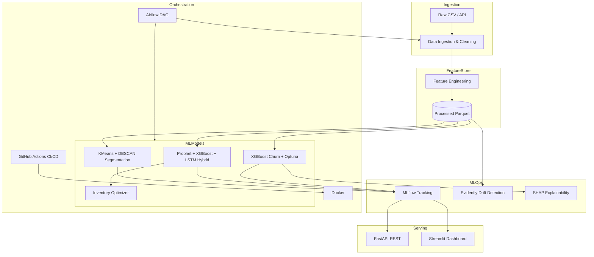

# RetailPulse – AI Powered Customer Analytics & Demand Forecasting Platform

[](https://github.com/your-org/RetailPulse/actions)
[](https://www.python.org/downloads/)
[](LICENSE)

> **Predictive Demand • Customer Segmentation • Churn Analysis • Inventory Optimization**

End-to-end production-grade data science platform for retail analytics. Built for portfolio, interview, and enterprise deployment scenarios aligned with **Zidio Development** standards (March 2026).

---

## Business Impact Targets

| Objective | Target |
|-----------|--------|
| Stockout reduction | 30–50% via demand forecasting |
| Revenue uplift | 15–25% through inventory optimization |
| Forecast accuracy | **MAPE ≤ 12%** |
| Churn detection | **ROC-AUC ≥ 0.88** |
| Batch processing | < 5 min daily jobs |
| Scale | 10M+ transactions/month |

---

## Architecture



---

## Project Structure

```
RetailPulse/
├── data/                    # Raw, processed, reference datasets
├── notebooks/               # Jupyter EDA notebooks
├── src/
│   ├── config/              # YAML settings
│   ├── data/                # Ingestion, cleaning, validation
│   ├── features/            # Advanced feature engineering
│   ├── eda/                 # Exploratory analysis
│   ├── models/              # Segmentation, forecasting, churn, inventory
│   ├── explainability/      # SHAP analysis
│   ├── monitoring/          # Evidently drift
│   ├── pipeline/            # End-to-end orchestrator
│   └── api/                 # FastAPI REST service
├── dashboard/               # Streamlit multi-page app
├── airflow/dags/            # Daily batch pipeline
├── mlflow/                  # Experiment tracking store
├── tests/                   # Unit & integration tests
├── scripts/                 # Training & data generation
├── Dockerfile
├── docker-compose.yml
└── requirements.txt
```

---

## Engineered Features

| Column | Description |
|--------|-------------|
| `TotalAmount` | Quantity × Price |
| `InvoiceMonth/Day/Hour` | Temporal decomposition |
| `WeekendFlag` | Weekend purchase indicator |
| `CustomerLifetimeValue` | Total customer revenue |
| `AvgOrderValue` | Mean order value per customer |
| `PurchaseFrequency` | Orders per day span |
| `DaysSinceLastPurchase` | Recency metric |
| `Rolling7DaySales` / `Rolling30DaySales` | Rolling demand |
| `Lag_1_Day_Sales` / `Lag_7_Day_Sales` | Lag features |
| `ProductCategory` | Rule-based product grouping |
| `CountrySalesRank` | Country revenue rank |
| `CustomerSegment` | RFM-based segment label |
| `ChurnFlag` | 90-day inactivity flag |
| `SeasonalIndex` | Monthly seasonality ratio |
| `InventoryRiskScore` | SKU volatility risk score |

---

## Quick Start

### 1. Clone & install

```bash
cd RetailPulse
python -m venv .venv
source .venv/bin/activate   # Windows: .venv\Scripts\activate
pip install -r requirements.txt
```

### 2. Generate sample data (or place your CSV at `data/raw/online_retail.csv`)

```bash
python scripts/generate_sample_data.py
```

**Expected columns:** Invoice, StockCode, Description, Quantity, InvoiceDate, Price, Customer ID, Country

### 3. Train all models

```bash
python scripts/train_all.py
```

### 4. Launch dashboard

```bash
streamlit run dashboard/app.py
```

Open **http://localhost:8501**

### 5. Launch API

```bash
uvicorn src.api.main:app --reload --port 8000
```

Open **http://localhost:8000/docs** for Swagger UI.

### 6. MLflow UI

```bash
mlflow ui --backend-store-uri mlflow/mlruns
```

---

## Dashboard Pages

| Page | Description |
|------|-------------|
| Executive Overview | KPIs, revenue trend, segment breakdown |
| Sales Analytics | Time series, geography, product categories |
| Demand Forecasting | Hybrid ensemble forecasts & MAPE |
| Customer Segmentation | KMeans/DBSCAN RFM scatter plots |
| Churn Prediction | Risk distribution, at-risk customers |
| Inventory Optimization | Reorder quantities & stock status |
| SHAP Explainability | Feature importance visualizations |
| Model Metrics | MLflow metrics & Evidently drift report |

---

## API Endpoints

| Method | Endpoint | Description |
|--------|----------|-------------|
| `GET` | `/health` | Service health check |
| `GET` | `/api/v1/metrics` | Model performance metrics |
| `POST` | `/api/v1/churn/predict` | Single-customer churn probability |
| `POST` | `/api/v1/forecast` | Demand forecast (1–90 days) |
| `GET` | `/api/v1/inventory` | SKU reorder recommendations |
| `GET` | `/api/v1/segments` | Customer segment assignments |

**Example – Churn prediction:**

```bash
curl -X POST http://localhost:8000/api/v1/churn/predict \
  -H "Content-Type: application/json" \
  -d '{
    "customer_id": "C00123",
    "customer_lifetime_value": 2500,
    "avg_order_value": 85,
    "purchase_frequency": 0.04,
    "days_since_last_purchase": 75,
    "rolling_7day_sales": 15000,
    "rolling_30day_sales": 60000,
    "seasonal_index": 1.05,
    "inventory_risk_score": 0.35
  }'
```

---

## Docker Deployment

```bash
# Build and run full stack
docker-compose up --build

# Services:
# - Dashboard: http://localhost:8501
# - API:       http://localhost:8000
# - MLflow:    http://localhost:5000
# - Airflow:   http://localhost:8080
```

**Single service:**

```bash
docker build -t retailpulse .
docker run -p 8501:8501 retailpulse dashboard
docker run -p 8000:8000 retailpulse api
```

---

## Airflow Pipeline

DAG: `retailpulse_daily_pipeline` (daily schedule)

1. Generate/validate raw data  
2. Run full ML pipeline (ETL → features → models → SHAP)  
3. Evidently drift detection  
4. Completion notification  

```bash
export AIRFLOW_HOME=./airflow
airflow db init
airflow dags test retailpulse_daily_pipeline
```

---

## CI/CD (GitHub Actions)

Pipeline stages:
1. **Lint** – Ruff static analysis  
2. **Test** – pytest with coverage  
3. **Train smoke** – Full pipeline with metric gates  
4. **Docker build** – Image build & health check (main branch)  

---

## Model Details

### Hybrid Demand Forecasting
- **Prophet** – Seasonality & trend decomposition  
- **XGBoost** – Lag/rolling feature regression  
- **LSTM (PyTorch)** – Sequential pattern learning  
- **Ensemble** – Weighted combination (35/35/30)  

### Churn Prediction
- XGBoost classifier with **Optuna** hyperparameter tuning  
- Stratified train/test split  
- SHAP TreeExplainer for interpretability  

### Customer Segmentation
- RFM matrix (log-transformed)  
- **KMeans** (6 clusters) + **DBSCAN** density clustering  
- Silhouette score validation  

### Inventory Optimization
- Safety stock (Z-score service level)  
- Economic Order Quantity (EOQ)  
- Forecast-driven reorder points  

---

## Configuration

Edit `src/config/settings.yaml` for paths, model hyperparameters, churn threshold, and MLflow settings.

Environment override:
```bash
export RETAILPULSE_CONFIG=/path/to/custom_settings.yaml
```

---

## Testing

```bash
pytest tests/ -v --cov=src
ruff check src tests scripts
```

---

## Using Real Data

Replace `data/raw/online_retail.csv` with the [UCI Online Retail Dataset](https://archive.ics.uci.edu/ml/datasets/Online+Retail) or your own data ensuring column names match (rename if needed).

---

## Author

**Zidio Development** – Data Science & Analytics Domain  
Version 2.0 – Industry Edition | March 2026

---

## License

MIT License – See [LICENSE](LICENSE) for details.
# RetailPulse2
